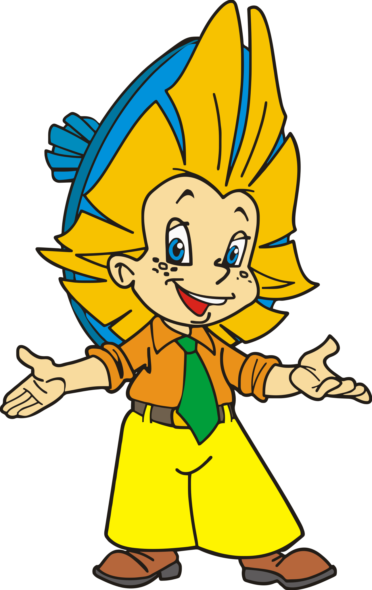

# Незнайка. Математика для малышей

  

### Целью проекта является развитие знаний в области элементарной математики, а так же тренировка в решении арифметических задач и задач на логику.

### Проект предназначен для детей дошкольного возраста, поэтому помимо задач, содержит в себе яркие иллюстрации, систему очков и наград.

### Также есть блок, демонстрирующий статистику ребенка, который позволяет отслеживать, в каких темах ребенок преуспевает, а каким темам ему нужно уделять больше времени.

### Проект представляет собой веб-приложение, написанное на Python, с использованием фреймворка Django.

## Как использовать:

1. Скачать этот репозиторий или клонировать его
2. Перейти в папку репозитория при помощи `cd`
3. `pip install -r requirements.txt`
4. `python3 manage.py runserver --insecure`

## Версии ПО:

Предполагается использование версии 4.1.7 фреймворка Django. Для ее запуска вам понадобится интерпретатор Python версии 3.8, 3.9, 3.10, 3.11 или (рекомендуется) 3.12.
